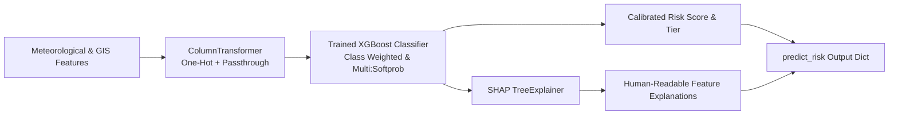

# Flash-Flood Risk Prediction ML Pipeline for Hilly Regions in India

A standalone, production-ready Machine Learning pipeline engineered to predict 24-hour flash-flood risk across complex mountainous terrains in India (e.g., Uttarakhand, Himachal Pradesh, Western Ghats, Wayanad, and Nilgiris).

The pipeline exposes a clean, single inference contract:
```python
predict_risk(features: dict) -> {
    "risk_level": "low" | "medium" | "high" | "critical",
    "risk_score": float,  # Continuous calibrated score (0.0 to 1.0)
    "explanation": {
        "rainfall_1h_mm": +0.3145,
        "soil_saturation_index": +0.2218,
        ...
    }
}
```

---

## 1. Feature Set Schema

The model consumes 12 pre-computed environmental, meteorological, and topographical features:

| Feature Name | Type | Range / Categories | Description & Hydrological Rationale |
| :--- | :---: | :---: | :--- |
| `rainfall_1h_mm` | `float` | $\ge 0.0$ mm | 1-hour rainfall accumulation. High values (>40 mm/hr) indicate intense convective bursts / cloudbursts capable of overwhelming soil infiltration capacity. |
| `rainfall_3h_mm` | `float` | $\ge \text{rainfall\_1h}$ | 3-hour cumulative precipitation. Measures rapid storm progression. |
| `rainfall_6h_mm` | `float` | $\ge \text{rainfall\_3h}$ | 6-hour cumulative precipitation. Crucial for medium-sized mountain sub-basins. |
| `rainfall_24h_mm` | `float` | $\ge \text{rainfall\_6h}$ | 24-hour cumulative rainfall. Drives total volumetric runoff and catchment water balance. |
| `soil_saturation_index` | `float` | $0.0 - 1.0$ | Current volumetric soil moisture / saturation ratio derived from SCS Curve Number method. When near 1.0, additional rainfall immediately transforms into overland kinetic runoff. |
| `slope_degrees` | `float` | $5.0^\circ - 70.0^\circ$ | Topographic gradient. Steeper slopes accelerate runoff velocity into high-energy debris flows and flash surges. |
| `elevation_m` | `float` | $300 - 4500$ m | Elevation above sea level. Controls orographic condensation patterns and vegetative cover. |
| `aspect` | `float` | $0.0^\circ - 360.0^\circ$ | Hill-slope azimuth orientation. In the Himalayas and Western Ghats, south/southwest facing slopes receive stronger monsoon moisture windward interception. |
| `historical_incident_density` | `float` | $\ge 0.0$ | Number of recorded flash-floods, debris flows, or landslide events per $\text{km}^2$ over the past 10 years (from GSI/NASA/NDMA catalogs). |
| `land_cover_class` | `string` | `forest`, `agriculture`, `urban`, `barren` | Infiltration & roughness coefficient. Urban and barren surfaces exhibit high runoff coefficients; dense forests retard flood wave propagation. |
| `distance_to_nearest_stream_m` | `float` | $\ge 0.0$ m | Distance to nearest riverbed, drainage channel, or seasonal mountain torrent (nallah). Communities within <150 m are at acute inundation risk. |
| `antecedent_moisture_condition` | `string` | `dry`, `normal`, `wet` | 5-day prior moisture class (SCS-CN AMC I: dry, AMC II: normal, AMC III: wet). Modulates the basin's retention capacity $S$. |

---

## 2. Architecture & Modeling Methodology



### A. Leak-Free Time-Based Train/Test Split
Mountainous weather phenomena are strongly auto-correlated across monsoon seasons. To prevent temporal leakage:
- **Training Set:** Chronological records from monsoon seasons prior to 2024 (2021–2023).
- **Test Set:** Unseen 2024 monsoon season. 
- Standard random k-fold shuffling is avoided because it would bleed seasonal weather fronts into evaluation.

### B. Class Imbalance Mitigation
Flash floods and cloudbursts are rare, high-consequence events (~5% critical, ~9% high risk). The pipeline utilizes:
1. `compute_sample_weight("balanced", y_train)` during XGBoost fitting.
2. Stratified fold evaluation optimizing **Macro F1** across all 4 risk tiers.

### C. SHAP Explainability Contract
For every prediction, `predict.py` executes `shap.TreeExplainer`:
- Transformed one-hot categories are attributed back to their root feature names.
- Outputs signed contribution values where positive numbers $(+0.31)$ indicate features pushing the catchment toward elevated risk, and negative numbers $(-0.15)$ indicate mitigating factors (e.g. dense forest cover, high distance from streams).
- Features are sorted in descending order of absolute importance so decision-makers instantly see the root cause for an alert.

---

## 3. Quick Start & Execution

### 1. Install Dependencies
```bash
pip install -r requirements.txt
```

### 2. Generate Physically-Plausible Training Data
```bash
python generate_dataset.py --samples 6000 --output data/flash_flood_data.csv
```
*(Optional: Provide `--real-catalog path/to/catalog.csv` to merge historical NASA/NDMA incident inventories).*

### 3. Train the Model
```bash
python train.py --data data/flash_flood_data.csv
```
Artifacts created:
- `models/xgb_flash_flood.joblib`
- `models/feature_metadata.json`
- `reports/train_metrics.json`

### 4. Evaluate Model & Generate SHAP Plots
```bash
python evaluate.py --data data/flash_flood_data.csv
```
Produces:
- `reports/confusion_matrix.png`
- `reports/shap_summary.png` (beeswarm summary)
- `reports/shap_bar.png` (global feature importance)
- `reports/evaluation_report.json`

### 5. Run Inference
In Python:
```python
from predict import predict_risk

sample_features = {
    "rainfall_1h_mm": 54.2,
    "rainfall_3h_mm": 92.5,
    "rainfall_6h_mm": 118.0,
    "rainfall_24h_mm": 172.4,
    "soil_saturation_index": 0.89,
    "slope_degrees": 36.8,
    "elevation_m": 1940.0,
    "aspect": 210.5,
    "historical_incident_density": 2.15,
    "land_cover_class": "barren",
    "distance_to_nearest_stream_m": 65.0,
    "antecedent_moisture_condition": "wet"
}

output = predict_risk(sample_features)
print(output)
```

### 6. Live Ingestion & Inference via `ml_database`
Query live weather, 30m DEM elevation/slope, and OpenStreetMap streams with 2-tier caching:
```bash
# Live Ingestion for Manali, Himachal Pradesh (Default)
python fetch_features_starter.py

# Custom coordinates (e.g. Mandi, HP)
python fetch_features_starter.py --lat 31.7087 --lon 76.9320
```

### 7. Run Unit Tests
```bash
# Root Pipeline Tests
python -m unittest test_pipeline.py -v

# Data Ingestion & Caching Tests (39 tests)
python -m unittest discover -s ml_database/tests -v
```

---

## 4. Stretch Goal: GRU Rainfall Nowcasting

File: `nowcast.py`

A 2-layer PyTorch Gated Recurrent Unit (GRU) model designed for short-term precipitation nowcasting:
- **Input:** 24-hour meteorological sequence `[batch, 24, 3]` (Rainfall, Relative Humidity, Barometric Pressure).
- **Output:** Forecasted cumulative precipitation for the next 6 hours `[1h, 2h, 3h, 4h, 5h, 6h]`.
- **Enrichment:** Can be invoked via `enrich_features_with_nowcast(features, sequence_24x3)` to feed proactive forecasted rainfall into the XGBoost feature pipeline before torrential rain physically falls.

Demo:
```bash
python nowcast.py --demo
```

---

## 5. Known Limitations & Caveats

1. **Synthetic Data Calibration:** Real high-altitude rain gauge records in the Himalayas and Western Ghats are historically sparse. The synthetic training dataset is grounded in SCS-CN hydrology and empirical mountain geomorphology, but should be fine-tuned with localized telemetry data from IMD (India Meteorological Department) or state disaster management portals once available.
2. **Micro-Topographic Wetness:** Sub-grid stream cross-sections and local bridge culvert blockages can alter inundation depth locally.
3. **Radar vs. Satellite Gaps:** In deep Himalayan valleys (e.g. Alaknanda, Beas), satellite precipitation estimates can suffer from mountain shadow effects; calibrated ground Doppler radar or automatic weather stations (AWS) provide the most reliable 1h inputs.
