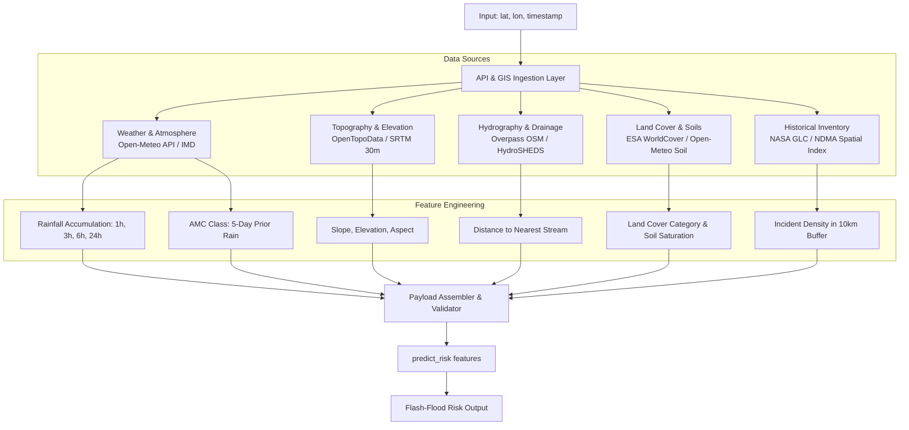

# Data Ingestion & Preprocessing Specification
## Guide for the Data Engineering & Backend Teammates

This document outlines the end-to-end data pipeline to transform raw geographic coordinates (`latitude`, `longitude`, `timestamp`) into the exact 12-feature schema required by `predict_risk(features: dict)`.

---

## 1. Pipeline Architecture



---

## 2. Source APIs & Data Providers

All recommended APIs below have **free tiers, high reliability, and zero or minimal setup requirements**.

### A. Live & Forecast Weather Data
* **Provider:** **Open-Meteo Weather API** (Free, no API key needed, non-commercial use up to 10k calls/day).
* **Endpoint:** `https://api.open-meteo.com/v1/forecast`
* **Query Parameters:**
  ```http
  GET https://api.open-meteo.com/v1/forecast?latitude=30.3165&longitude=78.0322&hourly=precipitation,relative_humidity_2m,surface_pressure,soil_moisture_0_to_7cm&past_days=5&forecast_days=1&timezone=Asia%2FKolkata
  ```
* **Variables Provided:**
  - `precipitation` (hourly rainfall in mm)
  - `soil_moisture_0_to_7cm` ($m^3/m^3$ volumetric moisture)
  - `relative_humidity_2m` (percent)
  - `surface_pressure` (hPa)

---

### B. Elevation, Slope & Aspect (Topography)
* **Provider:** **OpenTopoData API** (Free open-source DEM API) or local **Copernicus DEM GLO-30 / CartoDEM** GeoTIFF raster.
* **Endpoint:** `https://api.opentopodata.org/v1/copernicus30m`
* **Query Parameters:**
  ```http
  GET https://api.opentopodata.org/v1/copernicus30m?locations=30.3165,78.0322
  ```
* **How to compute Slope & Aspect:**
  Query a $3 \times 3$ grid around the target point ($\Delta = 0.0003^\circ \approx 30\text{ m}$) or query locally using `rasterio`:
  $$\text{Slope} = \arctan\left(\sqrt{\left(\frac{\partial z}{\partial x}\right)^2 + \left(\frac{\partial z}{\partial y}\right)^2}\right) \times \frac{180}{\pi}$$
  $$\text{Aspect} = \text{mod}\left(180 + \frac{180}{\pi} \arctan2\left(\frac{\partial z}{\partial y}, -\frac{\partial z}{\partial x}\right), 360\right)$$

---

### C. Distance to Nearest Stream / River (Riparian Proximity)
* **Provider:** **OpenStreetMap Overpass API** or local pre-clipped GeoPackage/Shapefile of Indian river networks (HydroSHEDS / Bhuvan).
* **Overpass Endpoint:** `https://overpass-api.de/api/interpreter`
* **Overpass Query:**
  ```ql
  [out:json][timeout:15];
  (
    way["waterway"~"river|stream|canal"](around:3000, 30.3165, 78.0322);
  );
  out geom;
  ```
* **Processing:**
  Compute Euclidean/Geodesic distance from `(lat, lon)` to the nearest line geometry in meters using `shapely.ops.nearest_points` or `geopandas.sindex`.

---

### D. Land Cover Classification
* **Provider:** **ESA WorldCover 10m** (AWS Open Data / S3 STAC) or **Copernicus Global Land Cover** / **Bhuvan LULC**.
* **Mapping Rule to Model Classes:**
  The model strictly requires one of four strings:
  - `forest`: Tree cover, mangroves, dense scrub ($>15\%$ canopy).
  - `agriculture`: Cropland, irrigated terraces, orchards.
  - `urban`: Built-up, paved roads, rural settlements, industrial structures.
  - `barren`: Bare soil, rock outcrops, scree, alpine gravel, glacial moraine.

---

### E. Antecedent Moisture Condition (AMC) & Soil Saturation
* **SCS-CN AMC Formula (5-Day Prior Cumulative Precipitation $P_5$):**
  From the weather API, sum the preceding 5 days of rainfall ($120\text{ hours}$):
  $$P_5 = \sum_{t=-120}^{0} \text{rainfall}(t)$$
  - **Dormant / Dry Season:**
    - If $P_5 < 12.5\text{ mm}$ $\implies$ `"dry"` (AMC I)
    - If $12.5\text{ mm} \le P_5 \le 27.5\text{ mm}$ $\implies$ `"normal"` (AMC II)
    - If $P_5 > 27.5\text{ mm}$ $\implies$ `"wet"` (AMC III)
  - **Growing / Monsoon Season (June–October):**
    - If $P_5 < 35.0\text{ mm}$ $\implies$ `"dry"` (AMC I)
    - If $35.0\text{ mm} \le P_5 \le 53.0\text{ mm}$ $\implies$ `"normal"` (AMC II)
    - If $P_5 > 53.0\text{ mm}$ $\implies$ `"wet"` (AMC III)
* **Soil Saturation Index ($0.0 - 1.0$):**
  Normalize volumetric soil moisture $\theta$ from Open-Meteo ($0.05$ to $0.50\text{ m}^3/\text{m}^3$ typical saturation range):
  $$\text{soil\_saturation\_index} = \text{clip}\left(\frac{\theta - \theta_{dry}}{\theta_{sat} - \theta_{dry}}, 0.0, 1.0\right)$$
  Where $\theta_{dry} \approx 0.08$ and $\theta_{sat} \approx 0.48$.

---

### F. Historical Incident Density
* **Source:** **NASA Global Landslide Catalog (GLC)** or **NDMA / GSI historical inventory**.
* **Formula:**
  Count all historical flood/landslide events within a $10\text{ km}$ radius circular buffer over the past 10 years, divided by the buffer area:
  $$\text{Area} = \pi \times 10^2 \approx 314.16\text{ km}^2$$
  $$\text{historical\_incident\_density} = \frac{\text{Count of events in 10 km}}{314.16}$$

---

## 3. The Target JSON Contract

Once extracted, format into a Python dictionary or JSON object matching this schema:

```json
{
  "rainfall_1h_mm": 42.5,
  "rainfall_3h_mm": 78.0,
  "rainfall_6h_mm": 95.2,
  "rainfall_24h_mm": 134.0,
  "soil_saturation_index": 0.85,
  "slope_degrees": 34.2,
  "elevation_m": 1780.0,
  "aspect": 185.0,
  "historical_incident_density": 1.45,
  "land_cover_class": "barren",
  "distance_to_nearest_stream_m": 120.0,
  "antecedent_moisture_condition": "wet"
}
```

Then invoke the model:
```python
from predict import predict_risk

result = predict_risk(features)
# result -> {"risk_level": "critical", "risk_score": 0.912, "explanation": {...}}
```
